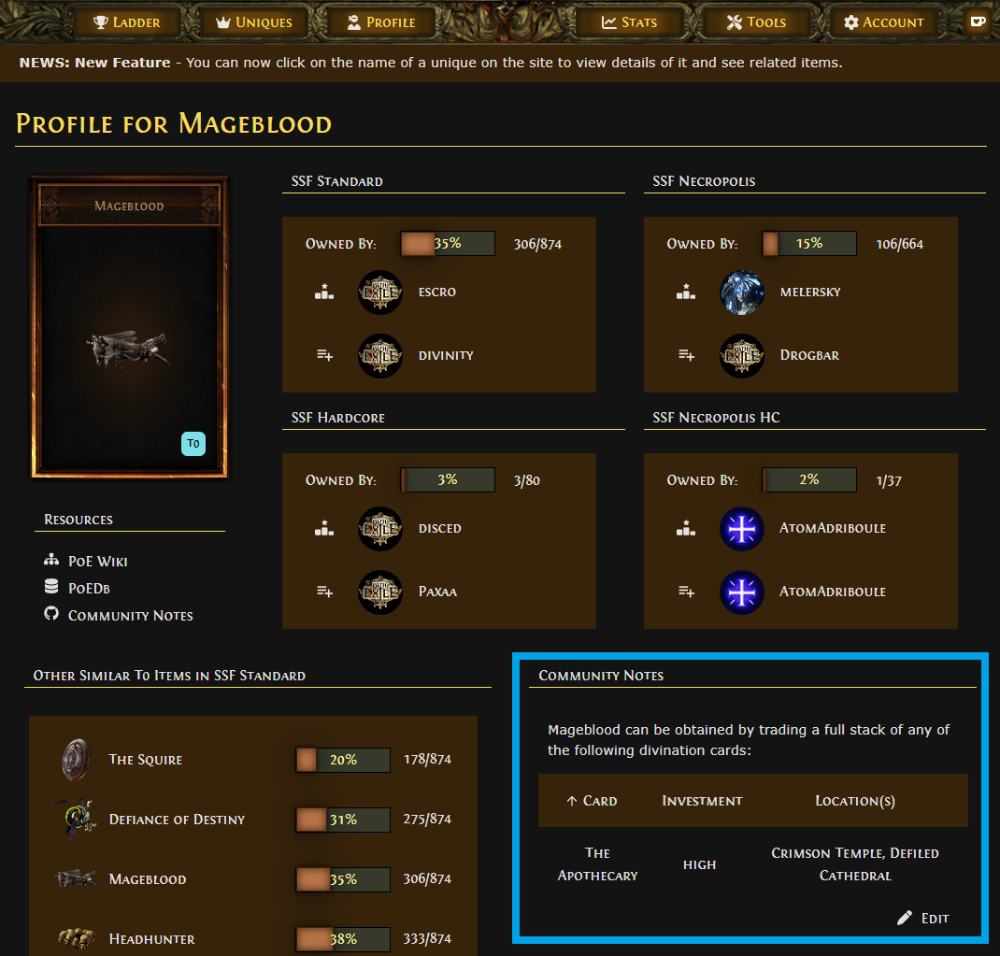
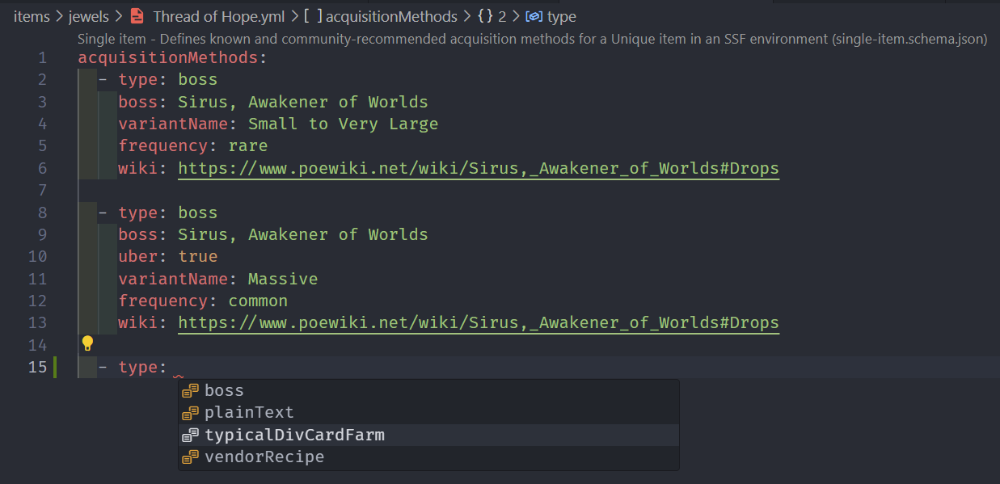
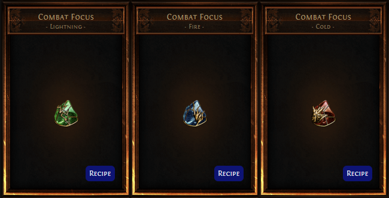

# poeladder-item-info

A community-maintained repository of SSF-oriented Unique acquisition methods. _[See example here](https://poeladder.com/uniqueprofile/Mageblood)_

## Overview

This project aims to provide Path of Exile players with community-sourced data about the different available acquisition methods for many Unique items - specifically in the context of an SSF (Solo Self-Found) environment.

The data from this project is viewable inside [poeladder.com](https://poeladder.com), the Unique collection one-stop-shop for SSF players - built by [@halfacandan](https://github.com/halfacandan). Simply click an item anywhere on the site and you'll be redirected to its dedicated item page (for example, here's [Mageblood](https://poeladder.com/uniqueprofile/Mageblood)). You'll find acquisition data from this project under the **Community Notes** section, as seen here:



> As you might notice, these notes are _specifically scoped to an SSF setting_ - they aim to **represent what SSF players typically do to get an item**, rather than all possible ways of acquiring it. For example, you can get Mageblood by turning in a set of The Insane Cat - but for SSF players, even seasoned ones, collecting a full set of this card is many times more unlikely. Likewise - you could get a Mageblood from turning in a set of The Wretched, but the odds of that happening are extremely small.

## How can I help?

Contributing new data for a Unique is easy! All you need is a GitHub account. **No coding experience is necessary.**

You can do everything right from your browser, but you can greatly enhance your experience if you use an IDE (such as [VSCode](https://code.visualstudio.com/download), which we recommend for this project). Read more on this [below](#recommended-ide).

There are three primary ways you can contribute to this project:

- [Adding data for items that don't have any yet](#how-do-i-add-or-edit-data)
- [Updating data for items with outdated data](#how-do-i-add-or-edit-data)
- [Reporting outdated data](#how-do-i-report-outdated-data)

All of these are helpful and we appreciate you for taking the time! Read on below for more info and a quick how-to.

## How does this work?

This project heavily leverages automation to help us ensure the data used by PoE Ladder remains consistent in its structure, and that changes to it are easy to review and tweak as necessary. It utilizes the standard GitHub PR workflow for collaboration, and GitHub Actions for data validation and the construction of the compiled data thats ends up on the website.

Here's a brief overview of how it's built, for the more tech-savvy folks:

- Items are organized into a class-based file hierarchy, with each item having its own YAML file, e.g. **`items/belts/Mageblood.yml`**
  - YAML files are easy to read and edit, which makes it possible for anyone to contribute changes
  - The file hierarchy mirrors that of the Unique collection tab, and as such it's easily browseable
- Each YAML file details one or more **acquisition methods** for its corresponding item
  - There are different types of acquisition methods for items - some can be farmed with a div card, others drop from a boss, others have a vendor recipe associated with them, etc.
  - Items with different variants (such as Precursor's Emblem rings) list each variant individually
- When a PR is opened, [a GitHub Actions workflow](./.github/workflows/ci.yml) is run. This workflow validates each individual item file against an **[item schema](./schemas/single-item.schema.json)**, which ensures the data for this item is kept in the predictable structure expected by PoE Ladder
  - If a file doesn't pass validation, a comment is automatically posted on the PR and lets the author know that there are schema validation errors that need to be fixed
  - This schema also provides **automatic code completion** when using VSCode with the [YAML Language Support by Red Hat](https://marketplace.visualstudio.com/items?itemName=redhat.vscode-yaml) extension installed (this is the reason an IDE is encouraged)
  - You can see more details about the schema in [the **Item file structure** section below](#item-file-structure)
- When a PR is merged to the `master` branch, all data is compiled (by [a different GitHub Actions workflow](./.github/workflows/release.yml)) into a single JSON file, which is then automatically made into a GitHub release for this repository. The [latest release](https://github.com/omriharel/poeladder-item-info/releases/tag/latest) always contains the most up-to-date version of this data, which can be downloaded directly [here](https://github.com/omriharel/poeladder-item-info/releases/download/latest/item-data.json)


## Contribution prerequisites

The only requirement is a **GitHub account**. You can [create one for free](https://github.com/join) if you don't have one.

### Recommended: IDE

While it is possible to make and submit changes using only your browser, we recommend to use an IDE (short for _Integrated Development Environment_).

We specifically recommend [VSCode](https://code.visualstudio.com/download) with the [YAML Language Support by Red Hat](https://marketplace.visualstudio.com/items?itemName=redhat.vscode-yaml) extension, which you can install directly inside VSCode by opening the Extensions pane (or from the link here).

The reason we're recommending this specific extension is a powerful feature it enables - **code completion**:



> Code completion works in real-time to help you fill out different details according to the item schema - it makes it very easy to add data and ensure that it validates correctly before you submit your changes for review.

## How do I add or edit data?

> The following explanation does not include specific instructions for how to do each of the steps on GitHub, it only serves as an overview. If you need any assistance with this, please [reach out to us](https://discord.gg/WXPJ6He2HA)! We'd be happy to help.

The general contribution workflow is a collaborative effort between a person wanting to contribute a set of changes (**"Author"**) and people who maintain the project's main repository (**"Maintainers"**).

At a baseline, it works like this:

- Author **forks the repository**, creating their own copy of it
- Author **creates a new branch** under their fork of the repository. This branch represents the _entire_ set of changes they would like to contribute (e.g. be adding data for one or more items)
- Author **works on their changes in their branch, committing and pushing them freely** as they progress
  - Please see [the **Item file structure** section below](./#item-file-structure) for an explanation on editing the individual item files themselves
- When Author is ready to contribute their changes back to the main repository, they **open a Pull Request (PR)** for their branch
- An **automated check* will run at that point. It takes between 30 seconds to a minute to complete. After it runs, if there are any validation errors in any of the files added or changed by Author, an automatic comment will be posted onto the Pull Request detailing the errors and requesting Author to make fixes and adjustments to them
- Author can fix any errors and push to their branch again. A separate check will occur for every push, until there are no errors
- Once the PR passes the validation, it is **ready for review**. At this point one or more Maintainers can review the changes by hand, ensuring that the contributed data is accurate and verified at the time of submission
- After the PR passes review, it is **ready to merge**. A maintainer can then merge it to the `master` branch of the main repository, at which point it will automatically be included in a release
- **PoE Ladder automatically updates itself to the latest data from this project every few hours**

If this seems overwhelming, have no fear - this workflow is more simple than it sounds, and we're more than happy to guide you through it. Please [reach out to us in the _#community-item-info_ channel of the PoE Ladder Discord server](https://discord.gg/WXPJ6He2HA).

## How do I report outdated data?

Please [open an issue](https://github.com/omriharel/poeladder-item-info/issues) on the project's GitHub page, or [contact us in the _#community-item-info_ channel of the PoE Ladder Discord server](https://discord.gg/WXPJ6He2HA). Make sure to include any relevant details. Thank you for your report!

## Item file structure

### Naming

Each item file follows the naming structure of `items/<class>/<exact-item-name>.yml`. It must be capitalized exactly as seen on PoE Ladder, and include any [special characters](./items/body-armours/Doppelgänger%20Guise.yml) if they are a part of the in-game item name.

### Item schema

Each item file must adhere to the **[item schema](./schemas/single-item.schema.json)**. For brevity, not every possible schema field is detailed here - instead, the aim is to give a general sense of how item files generally look.

Most item files will generally list one **acquistion method**. Let's take [Mageblood](./items/belts/Mageblood.yml) as an example:

```yaml
acquisitionMethods:
  - type: typicalDivCardFarm
    investment: high
    card: The Apothecary
    wiki: https://www.poewiki.net/wiki/The_Apothecary
    dropLocations:
      - Crimson Temple
      - Defiled Cathedral
```

This file, `items/belts/Mageblood.yml`, describes an item with a single **acquisition method**. There are various types of acquisition methods, which represent different game mechanics through which unique items can be obtained:

- Divination card farming in maps (`type: typicalDivCardFarm`)
- A random or guaranteed drop from a specific boss monster (`type: boss`)
- A vendor recipe (`type: vendorRecipe`)
- **To be expanded** - please note that the schema will be expanded soon to support more sources of items such as league-specific mecanics, Vaal Orb corruption outcomes and more
- Special circumstances which don't fit in other categories - these have a text-based description (`type: plainText`)

In this example of Mageblood, the `type: typicalDivCardFarm` field determines which other data fields can be populated for this acquisition method (as it now specifically describes a divination card farming strategy). These fields are:
  - `investment` - how much investment you'd need in terms of scarabs, maps, etc. to successfully complete a set
  - `card` - which card you're after
  - `wiki` - a reference to the card's wiki page on [poewiki.net](https://www.poewiki.net/wiki)
  - `dropLocations` - an array of area names that players generally farm for this card

Other acquisition methods have their own set of fields. These are present in full detail [inside the schema file itself](./schemas/single-item.schema.json), but will also be detailed below in the near future.

### Item variants

Some items, such as Combat Focus, have different **variants** that have different acquisition methods associated with them. These variants _usually_ count as separate item entries in the Unique collection tab as well - in the case of Combat Focus, it has three variants:



Items like this still have a single file - [`items/jewels/Combat Focus.yml`](./items/jewels/Combat%20Focus.yml) in this example - but it instead lists the individual variants of this item on PoE Ladder and the separate **acquisition method(s)** for each one:

```yaml
variants:
  Cold:
    acquisitionMethods:
      - type: vendorRecipe
        components:
          - Ruby Ring
          - Topaz Ring
          - Any gem with Prismatic tag (20% Quality)
        wiki: https://www.poewiki.net/wiki/Combat_Focus_(Crimson_Jewel)#Recipes
  Fire:
    acquisitionMethods:
      - type: vendorRecipe
        components:
          - Sapphire Ring
          - Topaz Ring
          - Any gem with Prismatic tag (20% Quality)
        wiki: https://www.poewiki.net/wiki/Combat_Focus_(Cobalt_Jewel)#Recipes
  Lightning:
    acquisitionMethods:
      - type: vendorRecipe
        components:
          - Sapphire Ring
          - Ruby Ring
          - Any gem with Prismatic tag (20% Quality)
        wiki: https://www.poewiki.net/wiki/Combat_Focus_(Crimson_Jewel)#Recipes
```

In this example, `variants` is an object mapping three variant names (`Cold`, `Fire` and `Lightning`) to their respective item info. Please note that variant names in this mapping must also correspond to the variant names as seen on PoE Ladder (see the above screenshot), and (like item files) they must be capitalized correctly as well.

An item file must **either** be for an item without variants (like the Mageblood example) or an item with variants (like the Combat Focus example) - in which case it must specify the `variants` field as seen here.

#### Note for items with different variants but only one slot in the Unique collection tab

Some items, such as [Thread of Hope](./items/jewels/Thread%20of%20Hope.yml) and Watcher's Eye, have different variants acquirable from different in-game sources, but a single item entry on PoE Ladder. In cases like this, they must _not_ use the `variants` option - instead, they should specify the separate in-game sources as different acquisition methods under the `acquisitionMethods` array.

**Only use `variants` for items which have an identical name but _separate_ slots in the Unique collection tab.**
